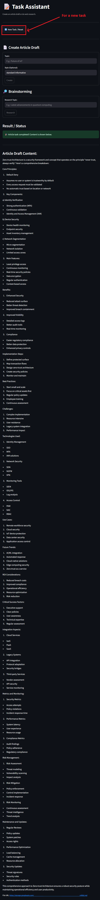

# Multi-Agent Task Assistant with A2A & MCP-inspired Architecture

This project demonstrates a multi-agent system designed for tasks like article drafting and web research. It features a custom Agent-to-Agent (A2A) communication protocol for inter-agent coordination and a Model Context Protocol (MCP)-inspired architecture for interacting with external tool servers. The system is built using Python, Langchain, Anthropic LLMs, FastAPI, and Docker.

## Overview

The Task Assistant allows users to request an article draft on a specific topic or perform web research. User inputs are first validated and processed by a "Supervisor LLM." Validated tasks are then managed by a `Task Manager Agent`, which delegates sub-tasks to specialized agents: an `Article Draft Agent` and a `Researcher Agent`. These agents leverage external capabilities (like LLM text generation, web searching, and cloud storage) through dedicated "MCP Tool Servers." A Streamlit application provides the user interface.

* The system has been reduced to input from each language and output in English.

[Click here to see examples of using the system.](#examples-of-task-1--task-2)

**Important: Google Cloud Authentication (`google_credentials.json`)**

To enable the `Cloud Storage MCP Server` to interact with Google Cloud Storage, you need to set up a service account and provide its JSON key:

1.  **Create a Service Account:** In your Google Cloud Platform (GCP) project, create a new service account.
2.  **Grant Permissions:** Assign the necessary roles/permissions to this service account to allow it to read from and write to your target GCS bucket (e.g., "Storage Object Admin" or more granular permissions like "Storage Object Creator" and "Storage Object Viewer" on the specific bucket).
3.  **Generate JSON Key:** Create a JSON key for this service account and download it.
4.  **Place and Rename Key:** Place the downloaded JSON key file into the **root directory** of this project and rename it to `google_credentials.json`.

⚠️ **Security Note:** This `google_credentials.json` file contains sensitive credentials. Ensure it is **never** committed to your version control system (e.g., add it to your `.gitignore` file if it's not already there). The `docker-compose.yml` file is configured to mount this file from the project root into the `cloud-storage-mcp` service.

## System Architecture


## Features

* **Article Drafting:** Generates an article draft on a given topic and style, then saves it to Google Cloud Storage, providing a public URL.
* **Web Research:** Performs simulated web research on a topic and returns a summarized list of findings.
* **Supervisor LLM Input Validation:** User inputs are pre-processed, validated for safety, and translated to English by an LLM before being assigned to agents.
* **Agent-to-Agent (A2A) Communication:** Custom protocol for agents to assign tasks, send status updates, and return results.
* **Model Context Protocol (MCP)-inspired Tooling:** Specialized servers expose tools (LLM generation, Cloud Storage, Web Search) via an MCP-like request/response pattern.
* **Asynchronous Task Processing:** Tasks are handled asynchronously, and the UI polls for status updates.
* **Microservice Architecture:** Components are containerized using Docker and orchestrated with Docker Compose.

## LLM Model Usage

This project leverages several Anthropic Claude models for different functionalities:

* **Supervisor LLM (Input Validation & Processing):**
    * **Model:** `claude-3-7-sonnet-20250219`
    * **Component:** Invoked directly by the Streamlit UI (`ui/streamlit/app.py`).
    * **Purpose:** Validates, sanitizes, checks for harmful content, identifies language, and translates user inputs (topic, style) to English before task assignment.

* **Article Draft Agent (Core Agent Logic):**
    * **Model:** `claude-3-haiku-20240307`
    * **Component:** `agents/article_draft/main.py`
    * **Purpose:** Powers the Langchain agent's decision-making process (e.g., determining which tool to use, how to sequence operations, and formulating final responses based on tool outputs).

* **Researcher Agent (Core Agent Logic):**
    * **Model:** `claude-3-haiku-20240307`
    * **Component:** `agents/researcher/main.py`
    * **Purpose:** Powers the Langchain agent's decision-making for research tasks and summarizing findings from the `search_web` tool.

* **Creative LLM MCP Server (Text Generation Tool):**
    * **Model:** `claude-3-5-sonnet-20241022`
    * **Component:** `mcp_servers/creative_llm/main.py`
    * **Purpose:** Provides the `generate_text` tool used by the `Article Draft Agent` to produce article content.

* **Web Search MCP Server (Simulated Web Search Tool):**
    * **Model:** `claude-3-haiku-20240307`
    * **Component:** `mcp_servers/web_search/main.py`
    * **Purpose:** Provides the `search_web` tool used by the `Researcher Agent` to generate simulated search results based on a query.

*Note: The `Task Manager Agent` and the `Cloud Storage MCP Server` do not directly utilize LLMs for their core operations.*

## Architecture

The system consists of the following key components:

1.  **Streamlit UI (`streamlit-ui`):** The web interface for users to submit tasks and view results. It also invokes the Supervisor LLM.
2.  **Supervisor LLM (External Call):** An Anthropic Claude model directly called by the UI to validate, sanitize, and translate user inputs.
3.  **Task Manager Agent (`task-manager`):**
    * Receives validated tasks from the UI.
    * Assigns tasks to appropriate worker agents using the A2A protocol.
    * Tracks task status and provides updates to the UI.
    * Receives results from worker agents via the A2A protocol.
4.  **Worker Agents:**
    * **Article Draft Agent (`article-draft-agent`):** A Langchain agent responsible for generating article content (using the Creative LLM MCP Server) and uploading it (using the Cloud Storage MCP Server).
    * **Researcher Agent (`researcher`):** A Langchain agent responsible for performing research (using the Web Search MCP Server).
5.  **MCP Tool Servers:**
    * **Creative LLM MCP Server (`creative-llm-mcp`):** Provides a `generate_text` tool powered by an Anthropic LLM.
    * **Cloud Storage MCP Server (`cloud-storage-mcp`):** Provides `upload_file`, `download_file`, and `delete_file` tools for Google Cloud Storage.
    * **Web Search MCP Server (`web-search-mcp`):** Provides a `search_web` tool that simulates web search results using an Anthropic LLM.
6.  **Communication Protocols:**
    * **Custom A2A Protocol:** Defined in `protocols/messages.py` (e.g., `A2AMessage`, `A2APayloadAssignTask`), used for communication between the Task Manager and worker agents over HTTP.
    * **Custom MCP-inspired Protocol:** Defined in `protocols/messages.py` (e.g., `MCPToolCall`, `MCPToolResult`), used by Langchain tools (via `tools/mcp_tool_adapter.py`) to communicate with MCP Tool Servers over HTTP.

**High-Level Flow (Article Task Example):**
1.  User submits an article topic/style via Streamlit UI.
2.  UI calls Supervisor LLM for input validation and processing.
3.  If approved, UI sends a request to the `task-manager` agent.
4.  `task-manager` assigns the "write_article_draft" task to `article-draft-agent` (A2A).
5.  `article-draft-agent` uses its `generate_text_tool`.
    * The tool calls the `creative-llm-mcp` server (MCP) to generate the article content.
6.  `article-draft-agent` then uses its `upload_file_tool`.
    * The tool calls the `cloud-storage-mcp` server (MCP) to upload the content and get a public URL.
7.  `article-draft-agent` sends the public URL back to `task-manager` (A2A).
8.  UI polls `task-manager` for status, retrieves the URL, fetches the content, and displays it.

## Core Technologies Used

* **Python 3.9**
* **Frameworks & Libraries:**
    * FastAPI: For building agent and MCP server APIs.
    * Uvicorn: ASGI server for FastAPI.
    * Langchain & Langchain-Anthropic: For building LLM-powered agents and tools.
    * Anthropic Python SDK: For Supervisor LLM and LLM tools.
    * Pydantic: For data validation and settings management in protocols.
    * Streamlit: For the user interface.
    * Requests: For HTTP communication.
    * Google Cloud Storage SDK (`google-cloud-storage`): For file storage.
* **Containerization:**
    * Docker
    * Docker Compose
* **Cloud Services:**
    * Anthropic API (Claude models)
    * Google Cloud Storage

## Project Structure
```
├── agents/
│   ├── article_draft/
│   │   ├── Dockerfile
│   │   └── main.py
│   ├── researcher/
│   │   ├── Dockerfile
│   │   └── main.py
│   └── task_manager/
│       ├── Dockerfile
│       └── main.py
├── mcp_servers/
│   ├── cloud_storage/
│   │   ├── Dockerfile
│   │   └── main.py
│   ├── creative_llm/
│   │   ├── Dockerfile
│   │   ├── main.py
│   └── web_search/
│       ├── Dockerfile
│       └── main.py
├── protocols/
│   └── messages.py       # Pydantic models for A2A and MCP communication
├── tools/
│   ├── generate_text_tool.py
│   ├── mcp_tool_adapter.py # Client for calling MCP tool servers
│   ├── research_tool.py
│   └── upload_file_tool.py
├── ui/
│   └── streamlit/
│       ├── Dockerfile
│       ├── app.py
│       └── requirements.txt
├── .env                    # For API keys and environment variables (create this)
├── config.py               # Internal service URLs
├── docker-compose.yml      # Docker Compose orchestration
└── google_credentials.json # Google Cloud service account key (create this)
```
## Prerequisites

* Docker and Docker Compose installed.
* An Anthropic API Key.
* A Google Cloud Project with:
    * Google Cloud Storage API enabled.
    * A GCS bucket created.
    * A service account key (`google_credentials.json`) with permissions to write to the GCS bucket.

## Setup & Running the Project

1.  **Clone the Repository (Example):**
    ```bash
    git clone https://github.com/ogulcanakca/article-assistant
    cd article-assistant
    ```

2.  **Create `.env` file:**
    Create a `.env` file in the project root and add your credentials and configuration:
    ```env
    ANTHROPIC_API_KEY="sk-ant-..."
    GOOGLE_API_KEY="AIzaSy..." # If needed by any other Google service, otherwise can be omitted if only GCS is used via service account
    GOOGLE_CLOUD_PROJECT="your-gcp-project-id"
    CLOUD_STORAGE_BUCKET_NAME="your-gcs-bucket-name" # Used by article_draft_agent
    ```
    * `CLOUD_STORAGE_BUCKET_NAME` is the name of the GCS bucket where articles will be stored.

3.  **Add Google Cloud Credentials:**
    Place your downloaded Google Cloud service account key file in the project root and name it `google_credentials.json`. This file is mounted into the `cloud-storage-mcp` service by `docker-compose.yml`.

4.  **Create `requirements.txt` for each service:**
    Ensure each service directory (`agents/*`, `mcp_servers/*`, `ui/streamlit`) has its own `requirements.txt` file listing its specific Python dependencies. For example:

    * `agents/article_draft/requirements.txt`:
        ```txt
        fastapi
        uvicorn
        langchain
        langchain-anthropic
        requests
        # pydantic is usually a transitive dependency of FastAPI/Langchain
        ```
    * `mcp_servers/cloud_storage/requirements.txt`:
        ```txt
        fastapi
        uvicorn
        google-cloud-storage
        requests
        ```
    * `ui/streamlit/requirements.txt`:
        ```txt
        streamlit
        requests
        anthropic
        ```
    *(Adjust these lists based on the actual imports in each `main.py` file.)*

5.  **Build and Run with Docker Compose:**
    From the project root directory, run:
    ```bash
    docker-compose up --build
    ```

6.  **Accessing the UI:**
    Once the services are up and running, open your web browser and go to:
    `http://localhost:8501`

7.  **Stopping the services:**
    ```bash
    docker-compose down
    ```

## Notes

* The `web-search-mcp` server currently *simulates* web search results using an LLM. It does not perform actual live web searches.
* Ensure all necessary environment variables (especially API keys and GCS bucket name) are correctly set in the `.env` file and passed to the respective services in `docker-compose.yml`.
* The `GOOGLE_API_KEY` in the `.env` is shown for completeness if other Google services were to be used directly with an API key. For Google Cloud Storage, the `google_credentials.json` service account is the primary authentication method used by the `cloud-storage-mcp` service.

## Examples of Task 1 & Task 2



